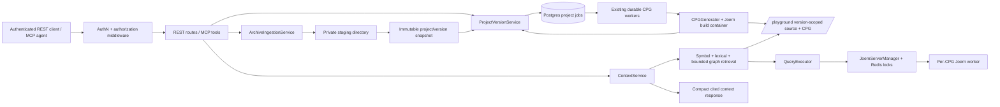

# Architecture Patterns

**Domain:** versioned codebase-ingestion and semantic-context backend over Joern CPGs  
**Researched:** 2026-08-09  
**Confidence:** HIGH for integration seams and operational constraints; MEDIUM for the proposed REST/MCP contract because it is a new product boundary.

## Recommended Architecture

Keep the existing FastMCP process as the trusted control plane and add a thin REST application on the same ASGI surface. REST and MCP must call the same application services; neither transport should directly access Postgres, the filesystem, or Joern. Preserve the existing Joern worker pool, Redis coordination, Postgres durable queue, and `QueryExecutor` as internal infrastructure.



The central modeling change is to make `project` and immutable `version` first-class records. A version owns one staged source snapshot, one content fingerprint, its lifecycle state, and at most one active CPG build. Existing `codebases.hash` should become a compatibility projection/cache key, not the public identity. Public APIs should use opaque project/version IDs; an agent must never select arbitrary filesystem paths or CPG hashes.

### Component Boundaries

| Component | Responsibility | Communicates With |
|---|---|---|
| REST/MCP transport adapters | Validate request shape, authenticate caller, map domain errors to HTTP/MCP responses; no business logic. | Auth middleware, application services |
| `ProjectVersionService` | Create/list/get projects and versions; own state transitions, idempotency keys, retention/deletion requests, and public DTOs. | Postgres catalog, ingestion service, job service |
| `ArchiveIngestionService` | Enforce upload limits, safely inspect/extract archives, compute manifest/content fingerprint, and atomically promote a validated snapshot. | Private staging area, version storage, validators |
| `BuildJobService` | Enqueue, expose, retry/cancel where supported, and reconcile build jobs. Translate a version job to the existing `generate_cpg` worker payload. | Postgres jobs, existing `DurableCPGQueue`, `CPGGenerator` |
| Existing CPG lifecycle | Generate/load CPGs; pool, evict, and reactivate Joern workers under the memory budget. | `CPGGenerator`, `JoernServerManager`, Redis, Docker |
| `ContextService` | Resolve a version, run bounded retrieval, rank/deduplicate results, load narrow source snippets, and return citations. | `CodeBrowsingService`/query templates, `QueryExecutor`, version catalog |
| Persistence repositories | Version/project/job metadata, idempotency and context cache. Keep SQL and migrations here. | Postgres only |
| Observability/audit | Correlation IDs, state-transition events, safe job error summaries, upload/retrieval metrics. | All boundary services; logs/telemetry |

### Integration Seams in the Current Repository

| Existing seam | Current behavior | v0.7 use / required change |
|---|---|---|
| `main.py` lifespan and `services` registry | Starts Postgres, Redis coordination, Joern manager, `CodebaseTracker`, `QueryExecutor`, and durable CPG queue. | Construct the new repositories/services here; mount REST routes before startup. Do not create another queue or another Joern client path. |
| `src/tools/mcp_tools.py` | Registers tool modules over FastMCP. | Add a small `context_tools.py` adapter after `ContextService` exists; existing analysis tools remain compatible. |
| `src/tools/core_tools.py` / `_generate_cpg_async` | Already stages source, persists initial status, queues generation, updates terminal state, and has queue/status helpers. | Extract/reuse its build orchestration behind `BuildJobService`; avoid duplicate lifecycle writes. Its internal job payload currently assumes codebase paths/hash. |
| `src/utils/postgres_db_manager.py` + `codebases` | Shared catalog keyed by hash, JSON metadata, tool cache/findings; row-locked metadata merges. | Add normalized `projects`, `project_versions`, version artifact metadata and job linkage. Keep a version-to-legacy-codebase mapping during migration. |
| `src/utils/postgres_job_store.py` | Durable, deduplicated active jobs with `FOR UPDATE SKIP LOCKED`; restart requeues all running jobs. | Add `project_version_id`/job metadata or a version build-job table. Maintain the active-job uniqueness rule per version, record attempts/errors, and make retry policy explicit. |
| `src/services/cpg_generator.py` | Builds CPG from a source path into `/playground/cpgs/<hash>/cpg.bin`, checks size/time, applies overlays. | Feed only promoted, version-scoped snapshot paths. Its path mapping and output location need to derive from server-side IDs, never upload filenames. |
| `src/services/query_executor.py` + `code_browsing_service.py` | Enforces per-CPG Redis lock, auto-wake, time/row/output caps, and cache-aware structured browsing. | Use as ContextService's graph source. Do not expose CPGQL or `QueryExecutor` directly through the new REST API. |
| `src/utils/validators.py` and security controls | Existing strict input/path/CPGQL validation and redaction. | Add archive-specific validation here or in a dedicated archive validator; retain existing boundary checks. |

### Data Model and Lifecycle

Recommended minimum relational model:

| Record | Key fields | Notes |
|---|---|---|
| `projects` | `id`, `owner/principal_scope`, `name`, `created_at`, `deleted_at` | Authorization scope belongs here even if initial deployment remains single-tenant. |
| `project_versions` | `id`, `project_id`, `ordinal/label`, `content_sha256`, `language`, `source_root`, `status`, `cpg_path`, `legacy_codebase_hash`, timestamps, error summary | Unique `(project_id, content_sha256)` supports idempotent uploads and reuse without treating a hash as public authority. |
| `artifacts` (optional, recommended) | `version_id`, `kind`, `path`, `size`, `sha256`, `created_at` | Separates archive, extracted snapshot, CPG, manifest and future derived artifacts. |
| `jobs` extension or `version_build_jobs` | `version_id`, `job_type`, `status`, `attempts`, payload/result/error, timestamps | One active CPG build per version; link API status directly to durable execution state. |
| `context_cache` (later) | version fingerprint, normalized query, retrieval options, response, expiry | Reuse only within the same version and access scope. Existing tool cache may remain analysis-tool-specific. |

Use a monotonic domain state machine owned by `ProjectVersionService`:

```text
created → uploading → staged → queued → building → ready
                                  │          │
                                  └──────────┴→ failed
ready → deleting → deleted
failed → queued   (explicit retry, creates/reuses a durable job)
```

The archive bytes are temporary input. Only promote a snapshot after complete validation and extraction; then create/commit the version record and enqueue the job. A database transaction cannot atomically include filesystem promotion, so use a recoverable two-step protocol: stage under a server-generated directory, write a manifest and checksum, atomically rename to its final version directory, then commit metadata; startup reconciliation removes orphaned staging directories and marks incomplete versions failed/repairable. Never let the CPG worker read the staging directory.

### Data Flow

#### Upload, snapshot, and build

1. An authenticated caller sends an archive plus project/version metadata and an idempotency key.
2. The transport applies body-size and rate limits. `ArchiveIngestionService` streams to a private, mode-`0700` staging directory with a server-generated filename; it does not trust archive member paths, archive filename, MIME type, or declared size.
3. The service inspects every member before extraction; rejects absolute/traversal paths, symlinks/hardlinks/devices/FIFOs, duplicate-normalized paths, excessive member count, compressed/uncompressed size ratio, depth, and unsupported archive types. Extract regular files only beneath the staging root with no-follow semantics and a cumulative byte cap.
4. It selects/validates a single source root, creates a manifest and content SHA-256, then promotes the snapshot to `playground/projects/<project-id>/versions/<version-id>/source` (or equivalent host path). The final directory is owned by the service and never caller-controlled.
5. `ProjectVersionService` persists `staged/queued` plus the version-to-legacy CPG cache key. `BuildJobService` enqueues one durable `generate_cpg` job. Return `202 Accepted` with version and job URLs; do not hold an upload request open for Joern.
6. Existing durable workers claim via `SKIP LOCKED`, transition `queued → building`, invoke the current generator using final source/CPG paths, and publish `ready` or `failed` with a sanitized error. The existing CPG path should be version-scoped, e.g. `.../versions/<id>/cpg/cpg.bin`, so different versions can coexist.
7. REST/MCP lifecycle adapters read the same version/job record. A ready version is queryable; building/failed versions return an explicit lifecycle response, never a connection-refused symptom.

#### Semantic context retrieval

1. A REST endpoint or MCP tool receives `{project_id, version_id, query or symbol, optional file/line hints, budget}`.
2. `ContextService` authorizes the version, requires `ready`, normalizes/clamps the request, and uses a strict maximum response budget.
3. Retrieval proceeds in explainable tiers: exact symbol/file lookup first; lexical candidate discovery second; bounded CPG relationships (definition, callers/callees, adjacent control/data-flow) third. It uses named/parameterized query templates and `QueryExecutor`, inheriting its timeout, row/output limits, Redis per-CPG lock, and auto-wake semantics.
4. The service deduplicates candidates, reads only cited snapshot files via a version-root-confined source reader, and packages compact excerpts. Each item carries `project_id`, `version_id`, repository-relative path, line range, symbol/relationship reason, and a stable citation ID. No absolute host path, raw Joern error, or unbounded node dump leaves the service.
5. The response declares truncation and retrieval limits. Cache only after authorization and key the cache by version fingerprint plus normalized retrieval parameters.

## Patterns to Follow

### Pattern 1: One application service, two transports

**What:** REST controllers and MCP tools are thin adapters over `ProjectVersionService`, `BuildJobService`, and `ContextService`.

**When:** For every new lifecycle or context operation.

**Why:** It prevents REST and MCP from drifting into separate status semantics, access checks, and query paths.

```python
# transport adapter shape; service owns authorization and domain policy
async def get_context(version_id: str, request: ContextRequest, principal: Principal):
    return await context_service.retrieve(
        version_id=version_id, request=request, principal=principal
    )
```

### Pattern 2: Version-scoped immutable artifacts

**What:** Derive all source, manifest, and CPG locations from internal project/version IDs; write them once and treat ready snapshots as immutable.

**When:** Upload, CPG generation, context source reads, deletion, retention.

**Why:** A CPG and its citations must refer to the exact source snapshot an agent asked about. This also eliminates cross-version overwrite races caused by using source labels or unscoped hashes as paths.

### Pattern 3: Durable state + durable job, with reconciliation

**What:** Persist version lifecycle and job lifecycle separately but link them transactionally where possible; reconcile them at startup and in status reads.

**When:** Queue admission, worker restart, explicit retry, worker failure, shutdown.

**Why:** Existing queue recovery requeues `running` jobs after restart. The version state needs the same recovery story or public status can become permanently `building`/`queued`.

### Pattern 4: Bounded, cited retrieval pipeline

**What:** Compose symbols, lexical candidates, and graph expansion into a deterministic pipeline with a global item/token/byte budget.

**When:** All AI-facing context responses.

**Why:** This uses v0.6's CPG strength without making raw CPGQL an agent-facing authority, and keeps results inspectable and useful in a limited model context window.

## Anti-Patterns to Avoid

### Anti-Pattern 1: Treating an uploaded archive as a local source path

**What:** Route archive contents into the current `source_type='local'` flow or pass caller paths to `CPGGenerator`.

**Why bad:** It bypasses archive extraction controls and conflates client data with trusted host paths; on chat deployments, local source input is intentionally disabled.

**Instead:** Add a distinct `archive` ingestion source that produces a server-owned, version-scoped snapshot before any build job is created.

### Anti-Pattern 2: Rebuilding queue and Joern orchestration for REST

**What:** Add a second REST worker loop, in-memory task, or direct Docker/Joern calls.

**Why bad:** It defeats Postgres dedup/backpressure and Redis-global memory admission, creating duplicate builds and unaccounted JVM pressure.

**Instead:** Adapt `DurableCPGQueue`/`CPGGenerator` through a build service; preserve the one active job and per-CPG memory model.

### Anti-Pattern 3: Exposing raw paths, hashes, or CPGQL as the public context contract

**What:** Let clients provide a CPG file path/hash or arbitrary CPGQL for context gathering.

**Why bad:** Paths and hashes become confused authorization tokens, raw CPGQL remains only best-effort sandboxed, and citations lose a stable version identity.

**Instead:** Resolve an authorized version ID inside `ContextService`; use fixed query templates and structured retrieval options.

### Anti-Pattern 4: Extract-then-validate archives

**What:** Use `extractall` and inspect results afterward.

**Why bad:** Traversal links, special files, and decompression bombs have already crossed the filesystem/resource boundary.

**Instead:** Validate each archive member and enforce cumulative caps before writing; extract only regular files through confinement checks.

## Scalability Considerations

| Concern | At 100 users | At 10K users | At 1M users |
|---|---|---|---|
| Uploads | Stream to local staging; enforce strict archive caps and bounded queue. | Move archives/staging to object storage or dedicated ingest volume; keep manifest in Postgres. | Separate authenticated upload service/object storage with malware scanning and quota accounting. |
| CPG builds | Existing Postgres queue, `build_workers`, cgroup cap, and memory budget are sufficient on the dedicated host. | Horizontally run workers only after version artifact storage is shared and job leases are robust. | Multi-node scheduler/tenant quotas; explicitly out of scope for v0.7. |
| Context reads | QueryExecutor auto-wake + Redis lock; cache compact per-version responses. | Read replicas/cache for metadata; prioritize/cancel queries and keep Joern pool admission global. | Precompute indexes/embeddings and shard artifacts/worker pools; vector-first retrieval remains deferred. |
| Storage | Version-scoped artifacts with retention/explicit delete; monitor CPG disk use. | Lifecycle policies and artifact GC; content-deduplicate only after correct authorization semantics. | Object storage, immutable manifests, legal retention and tenant deletion workflows. |
| Isolation | Single trust domain behind reverse-proxy auth; gate raw CPGQL. | Per-project authorization and worker mounts limited to one version. | True tenant isolation, network egress controls, separate credentials/control planes. |

## Build Order

1. **Foundation: catalog, IDs, migrations, and shared API shell.** Add project/version schema, repositories, state machine, authenticated REST routing, and an adapter boundary while preserving existing MCP operations.
2. **Secure ingestion.** Implement streamed archive staging, inspection/extraction, manifests, promotion/reconciliation, quotas, and deletion/retention semantics. No worker integration until the snapshot boundary is tested.
3. **Version build lifecycle.** Connect promoted versions to the existing durable queue and CPG generator; add version/job status and explicit retry behavior. Migrate existing `codebases` records through a compatibility mapping rather than breaking volumes.
4. **ContextService.** Implement fixed retrieval templates, version-confined source excerpts, citations, budgets, and REST/MCP adapters. Test ready/building/failed/sleeping versions and cache invalidation by version fingerprint.
5. **Hardening and operations.** Add auth enforcement, rate/size limits, audit-safe observability, storage GC, recovery tests, and Compose/deployment documentation. Consider stricter per-worker mounts and egress denial before any untrusted multi-project exposure.

The order is deliberate: semantic context cannot cite reliably until immutable versions exist; versions cannot safely reach the queue until archive promotion is secure; REST/MCP parity is safest when both are only adapters over the finalized services.

## Sources

- [Project scope and v0.7 decisions](../PROJECT.md) — HIGH confidence
- [Current architecture](../../docs/architecture.md) — HIGH confidence
- [Threat model and residual risks](../../docs/security.md) — HIGH confidence
- [Runtime assembly and dependency startup](../../main.py) — HIGH confidence
- [Postgres catalog implementation](../../src/utils/postgres_db_manager.py) and [durable job store](../../src/utils/postgres_job_store.py) — HIGH confidence
- [Existing CPG lifecycle](../../src/tools/core_tools.py), [generator](../../src/services/cpg_generator.py), and [query execution](../../src/services/query_executor.py) — HIGH confidence

## Architecture Research Gaps

- The repository has no REST/auth framework or identity model today. The exact FastMCP/Starlette route/middleware integration and the chosen authentication mechanism need phase-specific design and current framework documentation.
- Archive format policy (ZIP only versus tar variants), anti-malware scanning, maximum source counts/sizes, and retention duration are product/security decisions not specified in the milestone brief.
- Existing durable jobs requeue all `running` work on process restart but do not implement a bounded automatic retry policy for terminal failures. Define retry/cancel/idempotency semantics before exposing them as a public lifecycle API.
- The current worker model mounts the entire `/playground`; v0.7 should retain the documented single-tenant posture unless it implements per-version worker mounts and authorization isolation.
