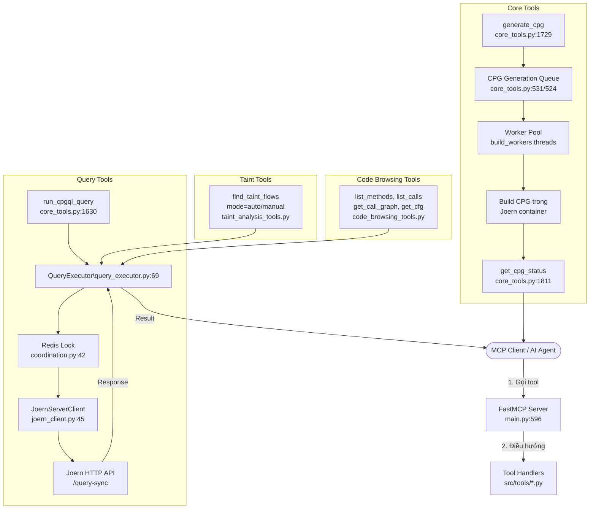
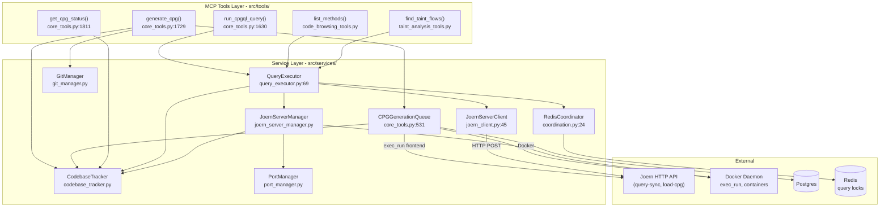

# CodeBadger MCP Server — Luồng hoạt động chi tiết

## 1. Mở đầu — Vấn đề

**CodeBadger là gì?**

CodeBadger là một **MCP server** (Model Context Protocol) cho phân tích mã nguồn tĩnh (SAST). Nó dùng **Joern** — một engine phân tích Code Property Graph (CPG) — để biến source code thành đồ thị, từ đó có thể:
- Tìm luồng dữ liệu độc hại (taint analysis)
- Phát hiện lỗ hổng bảo mật (buffer overflow, command injection, ...)
- Khám phá cấu trúc code (call graph, control flow, ...)

**Tại sao cần nó?**

Các SAST tool truyền thống (SonarQube, Fortify) thường chạy rule-based, dễ miss lỗi phức tạp. Joern biến code thành đồ thị rồi dùng **dataflow analysis** — tìm đường đi từ input → sink — phát hiện lỗi chính xác hơn. CodeBadger gói Joern thành MCP server để AI agents có thể gọi đến dễ dàng.

---

## 2. Kiến trúc tổng quan

CodeBadger gồm **4 containers** chạy trên Docker:

```
┌─────────────────────────────────────────────────────────────────────┐
│                        docker-compose                               │
│                                                                     │
│  ┌──────────────┐    ┌─────────────────┐    ┌──────────────────────┐│
│  │ codebadger-  │    │  codebadger-mcp  │    │  codebadger-joern-   ││
│  │ postgres     │◄──►│  (FastMCP app)   │◄──►│  server              ││
│  │ (port 55432) │    │  port 4242       │    │  (port range         ││
│  └──────────────┘    └───────┬──────────┘    │   13371-13870)       ││
│                              │               └──────────────────────┘│
│  ┌──────────────┐           │                                        │
│  │ codebadger-  │◄──────────┘                                        │
│  │ redis        │  Redis lock cho query serialization                 │
│  │ (port 56379) │                                                     │
│  └──────────────┘                                                     │
│  network: codebadger (bridge)                                         │
└─────────────────────────────────────────────────────────────────────┘
```

**Vai trò từng container**:

| Container | Vai trò |
|---|---|
| `codebadger-mcp` | FastMCP Python app — xử lý MCP requests, điều phối Joern |
| `codebadger-joern-server` | Joern engine — build CPG, chạy query servers |
| `codebadger-postgres` | Lưu codebase catalog, findings, job queue |
| `codebadger-redis` | Cross-process lock, coordination |

**2 worker modes** (configurable trong `config.yaml`):

- **shared mode** (default): query servers chạy như process trong `codebadger-joern-server` container
- **pool mode**: mỗi CPG chạy trong container riêng, cô lập tài nguyên

---

## 3. Luồng xử lý từ request → response



---

## 4. Từng bước một

### Bước 0: Khởi động server (`main.py:361-574`)

Khi container `codebadger-mcp` start, `app_lifespan` chạy:

```python
# main.py:367-431, 497-508
config = load_config("config.yaml")
db_manager = PostgresDBManager(database_url)
services['db_manager'] = db_manager
services['codebase_tracker'] = CodebaseTracker(db_manager)
services['git_manager'] = GitManager(config.storage.workspace_root)

joern_server_manager = JoernServerManager(...)
services['joern_server_manager'] = joern_server_manager

services['query_executor'] = QueryExecutor(joern_server_manager, ...)

register_tools(server, services)  # ĐĂNG KÝ TOOLS
```

**Giải thích**:
- `CodebaseTracker` — quản lý catalog codebase (Postgres)
- `JoernServerManager` — quản lý pool các Joern servers (start/stop/health check)
- `QueryExecutor` — thực thi CPGQL queries với Redis lock để serialize
- `register_tools` — đăng ký tất cả MCP tools (core, browsing, taint, custom)

### Bước 1: Đăng ký tools (`src/tools/mcp_tools.py:17-29`)

```python
# mcp_tools.py:20-22
def register_tools(mcp, services):
    register_core_tools(mcp, services)         # generate_cpg, get_cpg_status, run_cpgql_query, remove_cpg ...
    register_code_browsing_tools(mcp, services) # list_methods, list_calls, get_call_graph, get_cfg ...
    register_taint_analysis_tools(mcp, services) # find_taint_flows, find_taint_sources, find_taint_sinks ...
    # custom_tools.py (nếu có)
```

Mỗi function `register_*_tools` dùng decorator `@mcp.tool()` để gắn function vào FastMCP server.

### Bước 2: generate_cpg — Sinh CPG (`core_tools.py:1729`)

Khi client gọi `generate_cpg`, luồng xử lý:

```mermaid
flowchart TD
    A([generate_cpg called]) --> B{source_type?}
    B -->|local| C[Validate path\nvalidate_local_path]
    B -->|github| D[Clone repo\ngit_manager.py]
    B -->|snippet| E[Parse code tag\nparse_snippet_blocks]
    
    C --> F[Tính codebase_hash\nSHA256 của source]
    D --> F
    E --> F
    
    F --> G{Kiểm tra DB:\ncó tồn tại?}
    G -->|Có, ready| H[Return cached\ncodebase_hash]
    G -->|Có, generating| I[Return in-progress\ncodebase_hash]
    G -->|Chưa có| J[Copy source vào\nplayground/codebases/{hash}/]
    
    J --> K[Enqueue job\nCPGGenerationQueue]
    K --> L([Worker picks up job])
    L --> M[_generate_cpg_async\ncore_tools.py:1052]
    
    M --> N[1. Validate repo size]
    N --> O[2. Lấy Docker container]
    O --> P[3. Build frontend command]
    P --> Q[4. Pre-frontend cleanup\nrm .git, bin, obj, ...]
    Q --> R[5. exec_run frontend\n trong container]
    R --> S[6. Load CPG vào Joern\nload_cpg]
    S --> T[7. Update DB status → ready]
    T --> U([Client poll\nget_cpg_status → ready])
```

**Code tạo hash** (quan trọng cho caching):

```python
# core_tools.py (simplified)
source_string = f"{source_type}:{source_path}:{language}"
if github_token:
    source_string += f":token:{github_token[:8]}"
codebase_hash = hashlib.sha256(source_string.encode()).hexdigest()[:16]
```

**Code build command**:

```python
# core_tools.py:1130-1166
cmd = [cmd_binary, f"/playground/codebases/{codebase_hash}", "-o", container_cpg_path]

# Thêm --exclude-regex (nếu language hỗ trợ)
exclude_parts = []
if config and language in config.cpg.languages_with_exclusions:
    # Gom tất cả exclusion_patterns từ config.yaml
    exclude_parts.append("|".join(config.cpg.exclusion_patterns))

# Thêm include_globs để scope analysis
if include_globs and frontend_supports(language, "exclude_regex"):
    scope_rx = scope_exclude_regex(list(include_globs), src_exts)
    exclude_parts.append(scope_rx)

combined_exclude = combine_exclude_regexes(exclude_parts)
if combined_exclude:
    cmd.extend(["--exclude-regex", combined_exclude])

# Thêm --include paths (C/C++ headers)
if frontend_supports(language, "include"):
    for d in inc_dirs:
        cmd += ["--include", d]

# Thêm --define macros (C/C++ preprocessor)
if defines and frontend_supports(language, "define"):
    for macro in defines:
        cmd += ["--define", macro]
```

**Ví dụ command thực tế** (C#):
```text
csharpsrc2cpg /playground/codebases/5841f17f0963106d \
  -o /playground/cpgs/5841f17f0963106d/cpg.bin \
  --exclude-regex "(?:^|.*/)\..*|(?:^|.*/)test.*|..."
```

**Pre-frontend cleanup** (giải quyết bug C# dotnetastgen):

```python
# core_tools.py:1306-1321
# Xóa top-level dirs gây lỗi
for jd in (".git", "grammars", "Logs", "logs", "codebases", "cpgs"):
    container.exec_run(["rm", "-rf", f"{container_codebase}/{jd}"])

# Xóa bin, obj ở mọi cấp
container.exec_run(
    f"find {container_codebase} -type d \\( -name bin -o -name obj \\) -exec rm -rf {{}} +"
)
```

### Bước 3: run_cpgql_query — Chạy query (`core_tools.py:1630`, `query_executor.py:69`)

```mermaid
flowchart TD
    A([run_cpgql_query\ncodebase_hash + query]) --> B[Clamp timeout\n1..MAX_QUERY_TIMEOUT_SECONDS]
    B --> C[Lấy coordinator lock\ncodebase_hash]
    C --> D{Có server port?}
    D -->|Không| E{Status?}
    E -->|LOADING/GENERATING| F[Return \"still loading\"]
    E -->|SLEEPING/READY| G[Reactivate: load CPG\nvào Joern server mới]
    G --> D
    E -->|FAILED| H[Return error]
    D -->|Có| I[Kiểm tra health\ncheck_health()]
    I -->|Không respond| J[Return \"server not responding\"]
    I -->|OK| K[Normalize query\nthêm .take(limit) nếu cần]
    K --> L[POST /query-sync\ntới Joern HTTP API]
    L --> M{Timeout?}
    M -->|Có, đang loading| N[Return timeout, giữ server]
    M -->|Có, không loading| O[Terminate server\nset status → SLEEPING]
    M -->|Thành công| P[Return results]
    O --> Q([Query retry sẽ reactivate])
```

**Code normalize query**:

```python
# query_executor.py (simplified)
def _normalize_query(self, query: str, limit: Optional[int] = None) -> str:
    # Dataflow queries: cap results để tránh output quá lớn
    if "reachableByFlows" in query and limit is None:
        limit = _DATAFLOW_RESULT_LIMIT  # 50
    
    # Các query khác: thêm .take(limit)
    if limit and not query.strip().endswith(";"):
        query = f"{query}.take({limit})"
    
    return query
```

**Redis lock — serialize query per codebase**:

```python
# coordination.py:42-61
@contextmanager
def codebase_query_lock(self, codebase_hash: str) -> Iterator[None]:
    lock = self._redis.lock(
        f"codebadger:qlock:{codebase_hash}",
        timeout=660,          # auto-expire sau 660s
        blocking=True,
        blocking_timeout=660, # chờ tối đa 660s
    )
    if not lock.acquire():
        raise QueryLockTimeout("Another request holds this CPG")
    try:
        yield
    finally:
        lock.release()
```

### Bước 4: Taint Analysis — find_taint_flows (`taint_analysis_tools.py`)

**Auto mode** — một lần gọi quét tất cả:

```python
# Taint analysis auto mode (pseudocode)
def find_taint_flows_auto(codebase_hash):
    # 1. Tìm tất cả sources dựa trên config.yaml taint_sources
    sources = cpg.method.name(config.taint_sources[language]).callIn
    
    # 2. Tìm tất cả sinks
    sinks = cpg.method.name(config.taint_sinks[language]).callIn
    
    # 3. Chạy reachableByFlows (Joern's dataflow engine)
    flows = sinks.reachableByFlows(sources)
    
    # 4. Lọc qua sanitizers
    flows = flows.filter(not passes_through_sanitizer)
    
    return flows
```

**Các default sources/sinks từ `config.yaml`**:

| Ngôn ngữ | Source mẫu | Sink mẫu |
|---|---|---|
| C | `getenv, fgets, scanf, read, recv` | `system, popen, strcpy, sprintf, gets` |
| C# | `Console.ReadLine, Request.Form, Request.QueryString` | `Process.Start, Response.Write, File.WriteAllText` |
| Java | `getParameter, getHeader, getCookies` | `Runtime.exec, FileOutputStream, sendRedirect` |
| Python | `input, sys.argv, os.environ` | `eval, os.system, subprocess.Popen, pickle.load` |

---

## 5. Call Graph — Mối quan hệ các service



---

## 6. Analogy — Hình dung dễ hơn

Hãy tưởng tượng CodeBadger như **một công ty kiểm toán mã nguồn**:

| Bước | Analogy | Code |
|---|---|---|
| **1. generate_cpg** | "Mang codebase vào công ty, scan thành bản đồ" | Joern frontend parse source → AST → CPG |
| **2. exclude_regex** | "Bỏ qua mấy cuốn hướng dẫn, test thử" | Loại docs/, tests/, node_modules/ |
| **3. include_globs** | "Chỉ kiểm toán phòng WebApi với Application" | Scope build vào thư mục cụ thể |
| **4. load_cpg** | "Mở bản đồ lên bàn, sẵn sàng tra cứu" | importCpg → mở Joern server port |
| **5. get_cpg_status** | "Bản đồ đã xong chưa?" | Poll cho đến khi status = ready |
| **6. run_cpgql_query** | "Hỏi: những ai gọi hàm `strcpy`?" | `cpg.method.name("strcpy").callIn.l` |
| **7. find_taint_flows** | "Dò: data từ `Request.Form` đi qua đâu để ra `Process.Start`?" | `sinks.reachableByFlows(sources)` |
| **8. Redis lock** | "Chỉ một người xem bản đồ tại một thời điểm" | `codebadger:qlock:{hash}` |

---

## 7. Bảng mapping source code

| File | Vai trò |
|---|---|
| `main.py:361-574` | **Lifespan** — khởi tạo tất cả services, shutdown graceful |
| `main.py:596-599` | **FastMCP instance** — entry point cho M protocol |
| `main.py:895-913` | **/health endpoint** — dependency-aware health check |
| `src/tools/mcp_tools.py:17-29` | **register_tools** — đăng ký tất cả tools |
| `src/tools/core_tools.py:1052-1380` | **_generate_cpg_async** — build CPG trong Docker |
| `src/tools/core_tools.py:1630-1728` | **run_cpgql_query** — chạy CPGQL query |
| `src/tools/core_tools.py:1729-1810` | **generate_cpg** — entry point cho MCP tool |
| `src/tools/core_tools.py:1811-1830` | **get_cpg_status** — poll trạng thái CPG |
| `src/tools/core_tools.py:515-540` | **CPGGenerationQueue / DurableCPGQueue** — job queue |
| `src/tools/code_browsing_tools.py` | **Code browsing tools** — list_methods, list_calls, get_call_graph, etc. |
| `src/tools/taint_analysis_tools.py` | **Taint tools** — find_taint_flows, find_taint_sources, sinks |
| `src/services/query_executor.py:69-200` | **QueryExecutor** — thực thi query qua Joern API |
| `src/services/joern_client.py:45-200` | **JoernServerClient** — HTTP client gọi Joern API |
| `src/services/joern_server_manager.py` | **JoernServerManager** — quản lý pool server (large file, 66K) |
| `src/services/coordination.py:24-61` | **RedisCoordinator** — Redis lock cho query serialize |
| `src/services/codebase_tracker.py` | **CodebaseTracker** — CRUD codebase trong Postgres |
| `src/services/cpg_generator.py` | **CPG Generator** — logic copy source + build (19K) |
| `src/services/git_manager.py` | **GitManager** — clone GitHub repos |
| `src/services/port_manager.py` | **PortManager** — cấp phát port cho Joern servers |
| `src/config.py` | **Config loader** — đọc config.yaml với env substitution |
| `config.example.yaml` | **Config mẫu** — taint sources/sinks, exclusion patterns, sizing |
| `docker-compose.yml` | **Docker Compose** — 4 services, network, volumes |
| `Dockerfile.mcp` | **MCP image** — Python 3.13 + Docker CLI + git |

---

## 8. Data flow chi tiết cho một request điển hình

Lấy ví dụ: client gọi `run_cpgql_query(codebase_hash="5841f17f...", query="cpg.method.name.l")`

```
Client
  │
  ▼
FastMCP (main.py:596)
  │  FastMCP tự động parse arguments, route đúng function
  ▼
run_cpgql_query() (core_tools.py:1630)
  │  Validate codebase_hash, nhận services dict
  ▼
QueryExecutor.execute_query() (query_executor.py:69)
  │  1. Clamp timeout: max(1, min(timeout, MAX_QUERY_TIMEOUT))
  │  2. Lấy coordinator lock: acquire Redis lock
  │     key = "codebadger:qlock:5841f17f..."
  │  3. Kiểm tra server port
  │       - Nếu không có → reactivate (load CPG từ disk)
  │       - Nếu có → lấy JoernServerClient
  ▼
JoernServerClient (joern_client.py:45)
  │  HTTP POST → http://localhost:{port}/query-sync
  │  Body: {"query": "cpg.method.name.take(1000).toJsonPretty"}
  ▼
Joern Server (codebadger-joern-server container)
  │  Chạy CPGQL, trả về JSON
  ▼
QueryExecutor:
  │  4. Record execution_time
  │  5. Nếu timeout → terminate server (nếu không phải đang loading)
  │  6. Return QueryResult(success, data, execution_time)
  ▼
Client nhận kết quả
```

---

## 9. Các tool categories tổng hợp

| Category | Tools | Mục đích |
|---|---|---|
| **Core** | `generate_cpg`, `get_cpg_status`, `remove_cpg`, `run_cpgql_query` | Quản lý vòng đời CPG, chạy query |
| **Code Browsing** | `list_methods`, `list_calls`, `list_parameters`, `get_type_definition` | Khám phá code |
| **Graph** | `get_call_graph`, `get_cfg`, `get_program_slice`, `get_variable_flow` | Phân tích đồ thị |
| **Taint** | `find_taint_flows`, `find_taint_sources`, `find_taint_sinks` | Dataflow analysis |
| **Vulnerability** | `find_command_injection_sinks`, `find_stack_overflow`, `find_heap_overflow`, `find_format_string_vulns`, `find_integer_overflow`, `find_use_after_free`, `find_double_free`, `find_null_pointer_deref`, `find_toctou`, `find_uninitialized_reads`, `find_bounds_checks` | Phát hiện lỗ hổng |
| **System** | `get_backend_status`, `remove_cpg`, `get_cpgql_syntax_help` | Quản trị hệ thống |

---

## 10. Deployment options

CodeBadger hỗ trợ **3 chế độ deploy**:

1. **Docker Compose (khuyên dùng)** — `docker compose up -d` → chạy full stack
2. **Hybrid (MCP trên host)** — MCP chạy native, Joern + Postgres + Redis trong Docker
3. **Chat Deploy** — `CHAT_DEPLOY=true` → tắt `source_type=local`, chỉ cho phép GitHub/snippet (an toàn cho AI chat)
