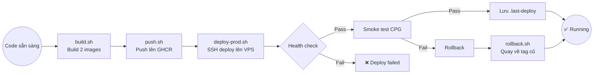

# CodeBadger Production Deploy Flow — Giải thích chi tiết

Tài liệu này giải thích toàn bộ luồng **Dev → Build → Push → Deploy → Rollback** của CodeBadger
sau Phase 1 (immutable images qua GHCR). Viết cho người mới, có code thật, analogy, và flowchart.

---

## 1. Vấn đề là gì?

Trước Phase 1, mỗi lần deploy lên VPS là chạy `docker compose up -d --build` — build image
**ngay trên VPS** từ source code. Vấn đề:

- **Không biết version nào đang chạy** — image chỉ có tag `latest`, không có SHA
- **Không rollback được** — nếu deploy lỗi, không có cách nào quay về version cũ
- **VPS cần full build toolchain** — Python, pip, dependencies phải có trên VPS
- **Không reproducible** — build trên VPS có thể khác build trên máy dev

**Giải pháp:** Build image một lần trên máy dev, push lên GitHub Container Registry (GHCR),
VPS chỉ pull về và chạy. Image được tag bằng git SHA — immutable, traceable, rollback-friendly.

---

## 2. Tổng quan luồng



**6 script, mỗi script một nhiệm vụ:**

| Script | Chạy ở đâu | Làm gì |
|--------|-----------|--------|
| `build.sh` | Máy dev | Orchestrator — gọi build từng image |
| `build-mcp.sh` | Máy dev | Build image `codebadger-mcp` với SHA tag |
| `build-joern.sh` | Máy dev | Build image `codebadger-joern-server` với SHA tag |
| `push.sh` | Máy dev | Tag GHCR prefix + push cả 2 image |
| `deploy-prod.sh` | Máy dev | SSH vào VPS, pull, up, health check, smoke test |
| `rollback.sh` | Máy dev | SSH vào VPS, đọc tag cũ, deploy lại |

---

## 3. Chi tiết từng bước

### Bước 1: Build images — `build.sh` → `build-mcp.sh` + `build-joern.sh`

`build.sh` là entry point, gọi tuần tự 2 script con. Mỗi script con:

1. Lấy **git SHA** hiện tại: `git rev-parse --short HEAD` → VD: `961fa87`
2. Build Docker image với **2 tag**: `latest` + SHA
3. Build cho **linux/amd64** (kiến trúc của VPS)

```bash
# scripts/build.sh:9-21 — Entry point
ROOT="$(cd "$(dirname "${BASH_SOURCE[0]}")/.." && pwd)"
cd "$ROOT"

echo "=== Building codebadger-mcp ==="
"$ROOT/scripts/build-mcp.sh"

echo ""
echo "=== Building codebadger-joern-server ==="
"$ROOT/scripts/build-joern.sh"

SHA=$(git rev-parse --short HEAD)
echo ""
echo "✅ Both images built: $SHA"
```

```bash
# scripts/build-mcp.sh:16-24 — Build MCP image với SHA tag
SHA=$(git rev-parse --short HEAD)
echo "Building codebadger-mcp:$SHA ..."

docker build \
  --platform linux/amd64 \
  -f Dockerfile.mcp \
  -t "codebadger-mcp:latest" \
  -t "codebadger-mcp:$SHA" \
  .
```

```bash
# scripts/build-joern.sh:16-24 — Build Joern image (Dockerfile, không phải Dockerfile.mcp)
SHA=$(git rev-parse --short HEAD)
echo "Building codebadger-joern-server:$SHA ..."

docker build \
  --platform linux/amd64 \
  -f Dockerfile \
  -t "codebadger-joern-server:latest" \
  -t "codebadger-joern-server:$SHA" \
  .
```

**Kết quả:** 4 tag local:

| Image | Tag | 
|-------|-----|
| `codebadger-mcp` | `latest`, `961fa87` |
| `codebadger-joern-server` | `latest`, `961fa87` |

> **Tại sao 2 tag?** `latest` là convenience — nếu rollback cần fallback nhanh.
> `961fa87` (SHA) là canonical — production luôn dùng SHA, không bao giờ `latest`.

---

### Bước 2: Push lên GHCR — `push.sh`

`push.sh` gắn prefix GHCR vào image local rồi push:

1. `docker tag` — đổi tên local image thành GHCR path
2. `docker push` — đẩy cả SHA tag + `latest` lên registry

```bash
# scripts/push.sh:17-25 — Gắn GHCR prefix rồi push
REGISTRY="ghcr.io/nguyenthanhhungdev140503"
SHA=$(git rev-parse --short HEAD)

echo "Tagging images for GHCR (sha=$SHA) ..."

docker tag "codebadger-mcp:$SHA"             "$REGISTRY/codebadger-mcp:$SHA"
docker tag "codebadger-mcp:latest"           "$REGISTRY/codebadger-mcp:latest"
docker tag "codebadger-joern-server:$SHA"    "$REGISTRY/codebadger-joern-server:$SHA"
docker tag "codebadger-joern-server:latest"  "$REGISTRY/codebadger-joern-server:latest"
```

| Trước tag | Sau tag |
|-----------|---------|
| `codebadger-mcp:961fa87` | `ghcr.io/nguyenthanhhungdev140503/codebadger-mcp:961fa87` |
| `codebadger-mcp:latest` | `ghcr.io/nguyenthanhhungdev140503/codebadger-mcp:latest` |
| `codebadger-joern-server:961fa87` | `ghcr.io/nguyenthanhhungdev140503/codebadger-joern-server:961fa87` |
| `codebadger-joern-server:latest` | `ghcr.io/nguyenthanhhungdev140503/codebadger-joern-server:latest` |

> **Lưu ý:** Phải `docker login ghcr.io` trước khi push. Dùng **GitHub PAT (classic)**
> với scope `write:packages`. Fine-grained PAT không hỗ trợ GHCR Packages.

---

### Bước 3: Deploy lên VPS — `deploy-prod.sh`

Đây là script phức tạp nhất, gồm 6 bước con qua SSH:

```bash
# scripts/deploy-prod.sh:31-81 — Toàn bộ flow deploy
echo "🚀 Deploying IMAGE_TAG=$IMAGE_TAG to $VPS ..."

# --- 1. Lưu tag hiện tại ---
CURRENT_TAG=$(ssh "$VPS" "cd $VPS_APP_DIR && grep '^IMAGE_TAG=' .env | cut -d= -f2" 2>/dev/null || echo "unknown")

# --- 2. Cập nhật IMAGE_TAG trong .env trên VPS ---
ssh "$VPS" "cd $VPS_APP_DIR && sed -i 's/^IMAGE_TAG=.*/IMAGE_TAG=$IMAGE_TAG/' .env"

# --- 3. Pull image mới + redeploy ---
ssh "$VPS" "cd $VPS_APP_DIR && docker compose pull"
ssh "$VPS" "cd $VPS_APP_DIR && docker compose up -d --no-build"

# --- 4. Health check (poll 30 lần, mỗi lần 2s) ---
MCP_PORT=$(ssh "$VPS" "cd $VPS_APP_DIR && grep '^MCP_PORT=' .env | cut -d= -f2" 2>/dev/null || echo "4242")
HEALTH_URL="http://localhost:${MCP_PORT}/health"

for i in $(seq 1 30); do
  if ssh "$VPS" "curl -fsS '$HEALTH_URL' 2>/dev/null | grep -q '\"status\"'"; then
    echo "   Health check passed."
    break
  fi
  if [[ $i -eq 30 ]]; then
    echo "❌ Health check timed out." >&2
    exit 1
  fi
  sleep 2
done
```

**Bước Health check giải thích:**
- Poll `GET /health` trên VPS qua `curl`
- Response JSON chứa `"status": "up"` hoặc `"status": "partial"`
- Thử tối đa 30 lần × 2s = 60s timeout
- Nếu qua 60s không có response → fail, không tiếp tục

**Bước Smoke test:** Gọi `scripts/smoke-test.sh` trên VPS để kiểm tra thực sự server hoạt động.

**Bước lưu rollback state:** Ghi tag cũ vào `/opt/codebadger/.last-deploy` — đây là "chìa khóa" để rollback.

| Thời điểm | `/opt/codebadger/.last-deploy` |
|-----------|-------------------------------|
| Trước deploy | `961fa87` (tag đang chạy) |
| Sau deploy thành công | `latest` (tag cũ được lưu lại) |

---

### Bước 4: Rollback — `rollback.sh`

Khi deploy mới gây lỗi, 1 lệnh duy nhất để quay về:

```bash
# scripts/rollback.sh:20-36
PREV_TAG=$(ssh "$VPS" "cat /opt/codebadger/.last-deploy 2>/dev/null" || true)
if [[ -z "$PREV_TAG" || "$PREV_TAG" == "unknown" ]]; then
  echo "ERROR: No previous deployment tag found" >&2
  exit 1
fi

echo "   Rolling back to: $PREV_TAG"

# Revert IMAGE_TAG trong .env
ssh "$VPS" "cd $VPS_APP_DIR && sed -i 's/^IMAGE_TAG=.*/IMAGE_TAG=$PREV_TAG/' .env"

# Pull image cũ + redeploy
ssh "$VPS" "cd $VPS_APP_DIR && docker compose pull"
ssh "$VPS" "cd $VPS_APP_DIR && docker compose up -d --no-build"
```

---

### Cơ chế resolve image trong docker-compose.yml

Đây là "trái tim" của toàn bộ hệ thống — 1 dòng YAML quyết định dev hay prod:

```yaml
# docker-compose.yml:3 — Joern server (dòng 27 cho MCP, pattern giống hệt)
codebadger-joern-server:
  image: ${IMAGE_REGISTRY:-}codebadger-joern-server:${IMAGE_TAG:-latest}
```

Cú pháp `${VAR:-default}` của Docker Compose: nếu `VAR` rỗng hoặc không set → dùng `default`.

| `IMAGE_REGISTRY` | `IMAGE_TAG` | Image resolve thành | Mode |
|-----------------|-------------|-------------------|------|
| (rỗng) | `latest` | `codebadger-joern-server:latest` | **Dev** — image local |
| `ghcr.io/user/` | `961fa87` | `ghcr.io/user/codebadger-joern-server:961fa87` | **Prod** — pull từ GHCR |

Không cần 2 file docker-compose khác nhau — cùng 1 file, `.env` quyết định behavior.

---

## 4. CallGraph — Quan hệ các script

```mermaid
graph TD
    subgraph "Máy Dev"
        Build[build.sh] --> BuildMCP[build-mcp.sh]
        Build --> BuildJoern[build-joern.sh]
        BuildMCP --> DockerCLI1[docker build -f Dockerfile.mcp]
        BuildJoern --> DockerCLI2[docker build -f Dockerfile]
        Push[push.sh] --> DockerTag[docker tag + GHCR prefix]
        DockerTag --> DockerPush[docker push]
        DeployProd[deploy-prod.sh] --> SSH[ssh codebadger]
        Rollback[rollback.sh] --> SSH2[ssh codebadger]
    end

    subgraph "VPS 160.250.4.40"
        SSH --> VPS1[save current tag]
        VPS1 --> VPS2[update .env IMAGE_TAG]
        VPS2 --> VPS3[docker compose pull]
        VPS3 --> VPS4[docker compose up -d --no-build]
        VPS4 --> VPS5[curl /health]
        VPS5 --> VPS6[smoke-test.sh]
        VPS6 --> VPS7[write .last-deploy]
        SSH2 --> VPS8[read .last-deploy]
        VPS8 --> VPS9[revert IMAGE_TAG in .env]
        VPS9 --> VPS10[docker compose pull + up]
    end

    subgraph "GHCR"
        DockerPush --> GHCR[(ghcr.io/nguyenthanhhungdev140503)]
        GHCR --> VPS3
    end
```

---

## 5. Ví dụ hình dung (Analogy) — Chuyển nhà bằng thùng carton

Hãy tưởng tượng bạn có một căn nhà cần chuyển đồ sang nhà mới (VPS).

**Cách cũ (build on VPS):** Bạn chở từng món đồ lẻ ra xe, rồi lắp ráp lại ở nhà mới.
Mỗi lần chuyển là một lần lắp ráp — tốn công, dễ sai, không biết đồ nào là của lần nào.

**Cách mới (GHCR images):**

| Bước | Script | Analogy |
|------|--------|---------|
| Build | `build.sh` | Đóng gói đồ vào **thùng carton** (Docker image), dán **nhãn SHA** (`961fa87`) |
| Push | `push.sh` | Chở thùng ra **kho trung chuyển** (GHCR) |
| Deploy | `deploy-prod.sh` | Gọi xe tải chở thùng từ kho đến nhà mới (VPS pull), **chụp ảnh nhãn thùng cũ** trước khi thay (`.last-deploy`) |
| Health check | (trong deploy) | Mở thùng, kiểm tra đồ còn nguyên vẹn (`/health`) |
| Smoke test | `smoke-test.sh` | Cắm điện, bật thử TV xem có chạy không (generate CPG) |
| Rollback | `rollback.sh` | Nếu TV hỏng → lấy **ảnh nhãn cũ**, gọi xe chở thùng cũ về, thay vào |

**Điểm mấu chốt:** Nhãn SHA là **bất biến** (immutable) — thùng `961fa87` luôn chứa đúng đồ của lần đóng gói đó.
Nhãn `latest` là **tạm thời** — thùng `latest` có thể bị ghi đè bất cứ lúc nào.
Production luôn dùng nhãn SHA.

---

## 6. Bảng mapping source code

| File | Vai trò |
|------|--------|
| `docker-compose.yml:3` | Cơ chế resolve image — `${IMAGE_REGISTRY:-}...${IMAGE_TAG:-latest}` cho Joern |
| `docker-compose.yml:27` | Cơ chế resolve image — tương tự cho MCP |
| `.env:93-97` | Khai báo `IMAGE_REGISTRY` và `IMAGE_TAG` |
| `scripts/build.sh:9-21` | Orchestrator — gọi `build-mcp.sh` + `build-joern.sh` |
| `scripts/build-mcp.sh:16-24` | Build MCP image — `docker build -f Dockerfile.mcp` với SHA tag |
| `scripts/build-joern.sh:16-24` | Build Joern image — `docker build -f Dockerfile` với SHA tag |
| `scripts/push.sh:17-40` | Tag GHCR prefix + push cả SHA lẫn `latest` |
| `scripts/deploy-prod.sh:31-81` | Deploy flow 6 bước: save tag → update .env → pull → up → health → smoke → save state |
| `scripts/deploy-prod.sh:35` | Bước 1 — lưu `CURRENT_TAG` từ VPS `.env` |
| `scripts/deploy-prod.sh:40` | Bước 2 — `sed -i` đổi `IMAGE_TAG` trong `.env` trên VPS |
| `scripts/deploy-prod.sh:43-47` | Bước 3 — `docker compose pull` + `up -d --no-build` |
| `scripts/deploy-prod.sh:49-64` | Bước 4 — poll `/health` 30 lần × 2s |
| `scripts/deploy-prod.sh:66-73` | Bước 5 — chạy `smoke-test.sh` trên VPS |
| `scripts/deploy-prod.sh:75-77` | Bước 6 — ghi `CURRENT_TAG` vào `/opt/codebadger/.last-deploy` |
| `scripts/rollback.sh:20-36` | Rollback: đọc `.last-deploy` → revert `IMAGE_TAG` → pull + up |
| `scripts/smoke-test.sh:28-37` | Smoke test: gọi `/health` và parse `status` field |
| `scripts/smoke-test.sh:48-57` | Smoke test: gọi MCP tools endpoint để xác nhận server hoạt động |
| `scripts/deploy.sh:93-100` | Dev mode (giữ nguyên) — `docker compose up -d --build` |
| `Dockerfile:3-28` | Joern image — download Joern từ GitHub Releases, cài Rust toolchain |
| `Dockerfile.mcp` | MCP image — Python 3.13 + FastMCP dependencies |
