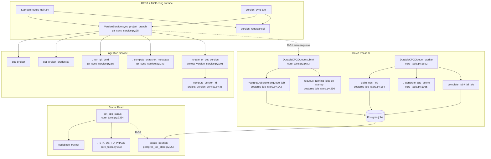

# Durable CPG Lifecycle & Backend Contract — Giải thích Kỹ Thuật

**Phạm vi:** Phase 6 (v0.7) — CodeBadger
**Trạng thái:** Phase 6 đang ở bước *thiết kế* (CONTEXT.md chưa implement). Tài liệu này giải thích **toàn bộ flow** của phase: phần **Đã Có** chú thích bằng code thật + số dòng, phần **Thiết Kế (D-xx)** tham chiếu quyết định trong `.planning/phases/06-durable-cpg-lifecycle-backend-contract/06-CONTEXT.md`, sẽ xuất hiện sau khi implement.

---

## 1. Vấn đề — Tại sao cần module này?

**Q: Sau khi tạo được một `ProjectVersion` (snapshot code bất biến), làm sao để biến nó thành CPG có thể query?**

Phase 5 xây phần **Ingestion** — đồng bộ Git branch, tạo version immutable. Nhưng version đó chỉ là thư mục source + DB row. Muốn AI agent query được (tìm symbol, taint, data flow) thì phải chạy **Joern** để build **CPG** — và việc build này:

- **Tốn tài nguyên** — Joern JVM build lớn, không thể chạy đồng bộ trong request
- **Phải bền (durable)** — nếu server restart giữa lúc build thì không được mất job
- **Phải đúng "một version = một build"** — submit 2 lần cùng version phải trả về cùng 1 job
- **Phải quan sát được** — client cần biết build đang ở trạng thái nào: đang xếp hàng? đang build? đã sẵn sàng?

Phase 6 kết thúc bằng 2 surface: **REST** và **MCP** — trả về schema **giống hệt nhau** để agent chuyển transport không phải học lại định dạng.

---

## 2. Nội dung chính — Từng bước một

Phase 6 có 4 luồng chính:

| Flow | Mô tả | Đã có / Thiết kế |
|---|---|---|
| **F1. Build trigger & job binding** | Sync → tạo version → auto-enqueue build | Một nửa: queue đã có, phần nối version↔job là **D-01..D-04** |
| **F2. Lifecycle state model** | `queued→building→loading→ready` + `failed`/`cancelled`, kèm `queue_position`/`elapsed`/`retry` | Cấu trúc status đã có; model version là **D-02, D-05, D-06** |
| **F3. Cancel, retry & recovery** | Hủy build, retry idempotent, phục hồi job khi restart | Recovery đã có; cancel/retry là **D-08..D-11** |
| **F4. REST + MCP parity** | Endpoint REST + tool MCP gọi cùng service, cùng schema | **D-12..D-16** — toàn bộ thiết kế |

---

### F1 — Build trigger & job binding

#### Bước 1. `sync_project_branch` — đồng bộ branch và tạo version

Người dùng gọi `POST /projects/{id}/versions/update` (REST) hoặc `version_sync` (MCP). Cả hai đi qua `GitSyncService.sync_project_branch`:

```python
# src/services/git_sync_service.py:95
async def sync_project_branch(
    self, project_id: str, branch: Optional[str] = None,
    build_config: Optional[Dict] = None, owner_scope: str = "default",
    timeout: int = 120,
) -> Tuple[Dict, str]:
    lock = _get_project_lock(project_id)
    async with lock:
        loop = asyncio.get_event_loop()
        return await loop.run_in_executor(None, self._do_sync, ...)
```

Giải thích:
- `_get_project_lock` (git_sync_service.py:28) — **asyncio.Lock** per project, hai sync cùng project không chạy song song.
- `_do_sync` chạy trong executor (khỏi chặn event loop).

Bên trong `_do_sync` (git_sync_service.py:117):

```python
# src/services/git_sync_service.py:178
cfg = build_config or {}
existing_ver = self.version_service.get_version(
    self.version_service.compute_version_id(project_id, commit_sha, cfg),
    owner_scope,
)
if existing_ver:
    shutil.rmtree(ws_dir, ignore_errors=True)
    return existing_ver.to_dict(), "unchanged"
```

Giải thích:
- `compute_version_id(project_id, commit_sha, cfg)` — hash SHA-256 16 ký tự = định danh immutable của version (project_version_service.py:45).
- Nếu đã tồn tại → trả `"unchanged"`, **không tạo version mới, không enqueue build**. Đây là nền tảng cho D-01 ("unchanged → không job mới").

Nếu version mới (chưa tồn tại): checkout detached → bỏ `.git` → tính digest/manifest (`_compute_snapshot_metadata`, git_sync_service.py:243) → promote snapshot → gọi `create_or_get_version`:

```python
# src/services/git_sync_service.py:219
version, status = self.version_service.create_or_get_version(
    project_id=project_id, commit_sha=commit_sha, branch=branch,
    content_digest=digest, build_config=cfg, manifest=manifest,
    source_snapshot_ref=snapshot_path, owner_scope=owner_scope,
)
```

Ví dụ mapping snapshot → version:

| Thành phần | Giá trị | Nguồn |
|---|---|---|
| `commit_sha` | `a1b2c3d4...` (40 ký tự) | `git rev-parse FETCH_HEAD` — git_sync_service.py:168 |
| `content_digest` | SHA-256 toàn bộ file | `_compute_snapshot_metadata` — git_sync_service.py:243 |
| `manifest` | `{file_count, total_bytes, files[{path,size,sha256}]}` | git_sync_service.py:271 |
| `source_snapshot_ref` | đường dẫn snapshot đã promote | git_sync_service.py:208 |

#### Bước 2. **[Thiết kế D-01] Auto-enqueue build sau khi version `created`**

Hiện tại `sync_project_branch` dừng ở `return version.to_dict(), status`. Phase 6 nối tiếp: khi `status == "created"` → gọi queue enqueue build cho version đó.

```
sync_project_branch trả "created"  →  enqueue DurableCPGQueue  →  build CPG nền
sync_project_branch trả "unchanged" → KHÔNG enqueue (đã có job hoặc đã ready)
```

#### Bước 3. **[Thiết kế D-02, D-03, D-04] Ràng buộc "một version = một job"**

- **D-03:** Durable queue thêm **partial unique index** `(job_type, version_id) WHERE status IN ('queued','running')` — DB tự chặn job trùng.
- **D-04:** Queue vẫn keyed bởi `codebase_hash` (toàn hệ thống cũ không đổi); khi build bắt đầu, đăng ký mapping `version_id ↔ codebase_hash + cpg_path` cho khâu expose/load.

---

### F2 — Lifecycle state model

#### Bước 1. Message queue nền — `DurableCPGQueue`

Queue **đã có** (Phase 3), là trái tim của Phase 6. Nó claim job bằng atomic SQL, nhiều worker/máy dùng chung:

```python
# src/utils/postgres_job_store.py:184
def claim_next_job(self, job_type: str) -> Optional[Dict[str, Any]]:
    with self._connect() as conn:
        row = conn.execute(
            "UPDATE jobs SET status = 'running', attempts = attempts + 1, updated_at = %s "
            "WHERE id = (SELECT id FROM jobs WHERE status = 'queued' AND job_type = %s "
            "ORDER BY created_at FOR UPDATE SKIP LOCKED LIMIT 1) "
            "RETURNING id, codebase_hash, job_type, payload, attempts",
            (now, job_type),
        ).fetchone()
        conn.commit()
```

Giải thích:
- `FOR UPDATE SKIP LOCKED` — hai worker claim cùng lúc không trùng job, không block nhau.
- `attempts = attempts + 1` — đếm số lần claim, phục vụ **retry cap** (D-11).
- `UPDATE ... RETURNING` — atomic: claim thắng là sở hữu job ngay.

Worker loop chạy job qua `_generate_cpg_async`:

```python
# src/tools/core_tools.py:1700
job = await loop.run_in_executor(None, self.store.claim_next_job, self.JOB_TYPE)
...
try:
    await _generate_cpg_async(**payload)
    await loop.run_in_executor(None, self.store.complete_job, job_id)
except Exception as e:
    await loop.run_in_executor(None, self.store.fail_job, job_id, str(e))
```

State của job trong bảng `jobs`: `queued → running → done | failed` (postgres_job_store.py:121).

#### Bước 2. **[Thiết kế D-05] Model 6 trạng thái trên version**

Job queue nói `queued/running/done/failed`. Version nới rộng thành 6 trạng thái:

| Trạng thái version (build_status) | Ý nghĩa | Nguồn |
|---|---|---|
| `queued` | Version đã enqueue, đang chờ worker | Job `queued` |
| `building` | Worker đang chạy Joern frontend (c2cpg parse source) | Job `running` + phase `building` |
| `loading` | CPG **đã build xong**, Joern đang load vào server | Phase `loading` (`_STATUS_TO_PHASE`, core_tools.py:393) |
| `ready` | CPG đã sẵn sàng query | Job `done` |
| `failed` | Build thất bại (sau hết retry) | Job `failed` |
| `cancelled` | Người dùng hủy, chưa tới trạng thái cuối | **D-08** |

`loading` tách riêng vì phase này đã tồn tại sẵn trong mã map:

```python
# src/tools/core_tools.py:393
_STATUS_TO_PHASE = {
    "generating": "building",
    "loading": "loading",
    "ready": "ready",
    "sleeping": "sleeping",
    "failed": "failed",
}
```

**Điểm nối:** `ProjectVersion` hiện có (models.py:76) chưa có cột `build_status`. **D-02/D-06** thêm cột này + metadata (`queue_position`, `elapsed_ms`, `retry_count`, `error_code`, `error`) — authoritative, không phải join bảng `jobs` mỗi lần đọc.

#### Bước 3. `get_cpg_status` — (mẫu trạng thái sẵn có, dùng làm nền cho status version)

Hàm đã tồn tại cho `codebase_hash`, Phase 6 bọc lại thành status của version:

```python
# src/tools/core_tools.py:2354
def get_cpg_status(codebase_hash: str) -> Dict[str, Any]:
    codebase_info = codebase_tracker.get_codebase(codebase_hash)
    status = codebase_info.metadata.get("status", "unknown")
    ...
    response["phase"] = phase  # từ _STATUS_TO_PHASE
    response["elapsed_seconds"] = round((_now_utc() - started).total_seconds(), 1)
```

**D-06:** version status expose `queue_position` (tính qua `PostgresJobStore.queue_position`, postgres_job_store.py:257) và `elapsed_ms`.

---

### F3 — Cancel, retry & recovery

#### Bước 1. [Thiết kế D-08, D-09] Hủy build (cancel)

```
POST /versions/{id}/cancel  →  check build_status
   ├─ ready/failed         →  từ chối (DB guard, không hủy trạng thái cuối)
   └─ queued/building/loading →  status = cancelled
                                 + xóa snapshot/chưa staged CPG một phần
                                 + GIỮ row version (provenance)
```

#### Bước 2. [Thiết kế D-10] Retry idempotent

```
POST /versions/{id}/retry  →  build_status == failed | cancelled
   ├─ reset build_status = queued
   └─ enqueue đúng 1 job (version_id dedup vẫn áp dụng)
retry trên queued/running → trả về cùng 1 job, không tạo job mới
```

#### Bước 3. [Thiết kế D-11] Startup reconciliation — đã có phần cốt lõi

Khi server khởi động, queue tự phục hồi job `running` từ lần chạy trước:

```python
# src/tools/core_tools.py:1661
async def start(self) -> None:
    try:
        requeued = self.store.requeue_running_jobs()
        if requeued:
            logger.info(f"Requeued {requeued} interrupted CPG generation job(s)")
```

```python
# src/utils/postgres_job_store.py:296
def requeue_running_jobs(self) -> int:
    cur = conn.execute("UPDATE jobs SET status = 'queued', updated_at = %s WHERE status = 'running'")
```

**D-11** bổ sung **retry cap**: `attempts` đã được tăng mỗi lần claim (postgres_job_store.py:190) — job chạm cap sẽ về `failed` với sanitized error thay vì requeue vô hạn.

---

### F4 — REST surface & MCP parity

#### Bước 1. [Thiết kế D-12] Một process, một port

FastMCP đã chạy Starlette (main.py:596). REST routes mount vào **chính app đó** — share `services` dict, không port riêng.

#### Bước 2. [Thiết kế D-14] Endpoint REST

| Method | Path | Chức năng | Decision |
|---|---|---|---|
| POST | `/projects` | Tạo project | API-01 |
| GET | `/projects` | List projects | |
| GET | `/projects/{id}` | Chi tiết project | |
| POST | `/projects/{id}/versions/update` | Git sync + auto-enqueue build | **D-01** |
| POST | `/projects/{id}/versions` | Upload archive → version | **D-13** |
| GET | `/versions` | List versions | |
| GET | `/versions/{id}` | Detail + status | **D-05/06** |
| POST | `/versions/{id}/retry` | Retry idempotent | **D-10** |
| POST | `/versions/{id}/cancel` | Cancel + dọn artifact | **D-08/09** |
| DELETE | `/projects/{id}` | Xóa project | |

#### Bước 3. [Thiết kế D-15] MCP tools gọi cùng service, cùng schema

| MCP tool | REST tương đương |
|---|---|
| `project_create` | `POST /projects` |
| `project_list` | `GET /projects` |
| `version_sync` | `POST /projects/{id}/versions/update` |
| `version_upload` | `POST /projects/{id}/versions` |
| `version_list` / `version_get` | `GET /versions` / `GET /versions/{id}` |
| `version_retry` / `version_cancel` | `POST /versions/{id}/retry` / `cancel` |
| `project_delete` | `DELETE /projects/{id}` |

Cả REST và MCP gọi **cùng service method** → trả envelope chung: `id`, `status`, `phase`, `queue_position`, `elapsed_ms`, `retry_count`, `error_code`/`error` sanitized. **D-07:** error chỉ lưu dạng sanitized (bỏ credential, host path, stack trace) — kế thừa `_mask_text` (git_sync_service.py:34).

---

## 3. Flowchart — Sơ đồ xử lý logic

```mermaid
flowchart TD
    Start((Client)) --> Call[POST /versions/update<br/>hoặc version_sync]
    Call --> Lock[[_get_project_lock per project]]
    Lock --> Fetch[git fetch --depth=1<br/>ephemeral header auth]
    Fetch --> SHA[git rev-parse FETCH_HEAD]
    SHA --> Check{compute_version_id<br/>đã tồn tại?}
    Check -->|Có| Unchanged[Return version + 'unchanged'<br/>KHÔNG enqueue job]
    Check -->|Không| Checkout[checkout --detach<br/>bỏ .git]
    Checkout --> Digest[compute digest + manifest]
    Digest --> Promote[Promote snapshot]
    Promote --> VerDb[['INSERT project_versions']]
    VerDb --> Created{status == created?}
    Created -->|Không| ReturnAlt[Return version + status]
    Created -->|Có D-01| Enqueue[Enqueue job<br/>dedup version_id D-03]
    Enqueue --> JobStore[['jobs: queued']]
    JobStore --> Worker[[DurableCPGQueue._worker<br/>claim FOR UPDATE SKIP LOCKED]]
    Worker --> Run[Job running + phase=building]
    Run --> Frontend{Joern frontend?}
    Frontend -->|Lỗi| Fail[Job failed<br/>sanitized error]
    Frontend -->|OK| Gen[CPG tạo xong + phase=loading]
    Gen --> Load{Joern load server?}
    Load -->|Lỗi| Fail
    Load -->|OK| Ready[version build_status = ready]
    Fail --> RetryCheck{retry_count < cap? D-11}
    RetryCheck -->|Có| Enqueue
    RetryCheck -->|Không| FailFinal[version = failed]
    Ready --> GetStatus[GET /versions/{id}/status<br/>queue_position + elapsed_ms]
    Unchanged -. khác call .-> RetryCancel[POST retry/cancel D-08..D-10]
    RetryCancel --> Enqueue
```

---

## 4. CallGraph — Sơ đồ quan hệ hàm



---

## 5. Ví dụ hình dung (Analogy) — Dây chuyền sản xuất & kho hàng

Giả sử bạn quản lý **nhà máy đóng hàng**:

| Bước | Flow Phase 6 | Analogy nhà máy |
|---|---|---|
| 1 | `register_project` | Ký hợp đồng với nhà cung cấp (đăng ký nguồn repo) |
| 2 | `version_sync` — fetch branch mới | Tài xế đi lấy **cùng lô hàng** (commit) từ nhà cung cấp |
| 3 | `compute_version_id` — check trùng | Tra sổ kho xem **lô này đã nhập chưa** — đã có thì về tay không (`unchanged`) |
| 4 | `create_or_get_version` + promote snapshot | Lưu lô hàng vào **kho** với mã lô bất biến |
| 5 | Auto-enqueue build (D-01) | Tự động đưa lô lên **băng chuyền đóng gói** (Joern build) |
| 6 | Job `queued` | Hàng chờ trên băng, xếp theo thứ tự `queue_position` |
| 7 | Job `building` / `loading` | Máy đóng gói chạy (parse source) → cho sản phẩm lên kệ (load CPG) |
| 8 | `ready` | Sản phẩm hoàn thiện, agent query được |
| 9 | `failed` + retry | Gói hỏng → đưa lại đầu băng (reset `queued`), tối đa N lần (retry cap) |
| 10 | `cancel` | Dừng máy giữa chừng, vứt bán thành phẩm, **giữ sổ kho** (version row) |
| 11 | Startup recon (`requeue_running_jobs`) | Mất điện → sáng hôm sau những lô **đang đóng dở** được đưa lại đầu băng |

Key insight: **version = sổ kho (bất biến)**, **job = băng chuyền (trạng thái thoáng qua)**. Sổ không đổi, băng thì có thể dừng/nối lại.

---

## 6. Bảng mapping source code

| File | Vai trò |
|---|---|
| `src/services/git_sync_service.py:95` | `sync_project_branch` — fetch branch, resolve SHA, snapshot, trả `(version, status)` |
| `src/services/git_sync_service.py:55` | `_run_git_cmd` — CLI an toàn, `shell=False`, credential qua `GIT_CONFIG` header, không vào argv |
| `src/services/git_sync_service.py:243` | `_compute_snapshot_metadata` — content digest + manifest |
| `src/services/project_version_service.py:201` | `create_or_get_version` — insert/return immutable version, `created`/`unchanged` |
| `src/services/project_version_service.py:45` | `compute_version_id` — định danh version từ sha + build config |
| `src/models.py:76` | `ProjectVersion` — cần thêm `build_status` + metadata (D-02/D-06) |
| `src/services/coordination.py:24` | `RedisCoordinator` — lock cross-process cho build/expose (D-04) |
| `src/tools/core_tools.py:1623` | `DurableCPGQueue` — queue Postgres bền vững, worker loop |
| `src/tools/core_tools.py:1661` | `DurableCPGQueue.start` — `requeue_running_jobs()` recovery |
| `src/tools/core_tools.py:393` | `_STATUS_TO_PHASE` — map status → phase (`building`/`loading`/`ready`) |
| `src/tools/core_tools.py:1065` | `_generate_cpg_async` — chạy Joern frontend + load |
| `src/tools/core_tools.py:2354` | `get_cpg_status` — (nền tảng) status + `elapsed_seconds` |
| `src/utils/postgres_job_store.py:142` | `enqueue_job` — dedup + backpressure, trả `submitted/duplicate/queue_full` |
| `src/utils/postgres_job_store.py:184` | `claim_next_job` — `FOR UPDATE SKIP LOCKED`, tăng `attempts` |
| `src/utils/postgres_job_store.py:296` | `requeue_running_jobs` — khôi phục job `running` khi restart |
| `src/utils/postgres_job_store.py:116` | `init_schema` — tạo bảng `jobs` (nơi thêm unique index version_id, D-03) |
| `main.py:596` | `FastMCP(...)` — app Starlette, nơi mount REST routes (D-12) |
| `docs/security.md` | Trust boundary, sanitization — ràng buộc error không lộ credential |

---

## Kiểm tra chất lượng

- [x] Giải thích Vấn đề → Giải pháp (mục 1)
- [x] Code snippet + file path + line number (mục 2)
- [x] Bảng mapping transform (F1 bước 1; mục 4 callgraph)
- [x] Flowchart Mermaid (mục 3)
- [x] CallGraph Mermaid (mục 4)
- [x] Analogy nhà máy (mục 5)
- [x] Bảng source mapping (mục 6)
- [x] Line number khớp codebase hiện tại (phần Đã Có)

**Lưu ý:** phần dành riêng cho Phase 6 chưa implement (`build_status` trên version, unique index `version_id`, REST routes, MCP tools, retry cap, cancel) đánh dấu **[Thiết kế D-xx]** — tham chiếu `.planning/phases/06-durable-cpg-lifecycle-backend-contract/06-CONTEXT.md`. Sau khi implement, cập nhật các mục này bằng line number thật.