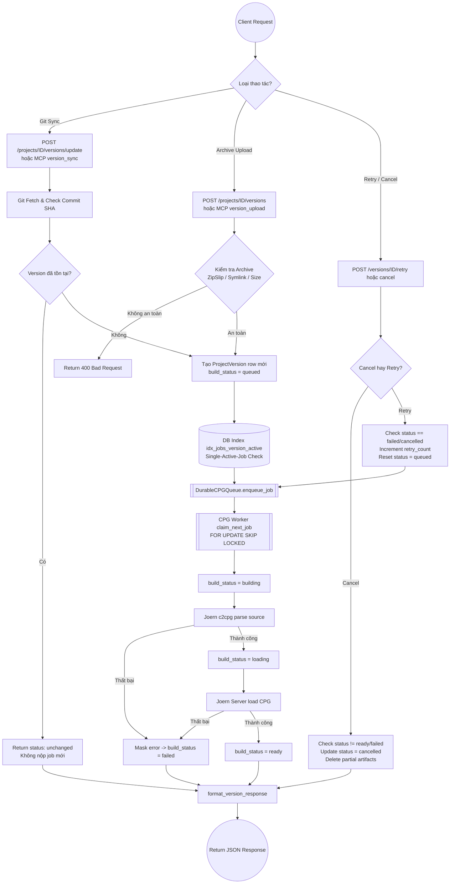
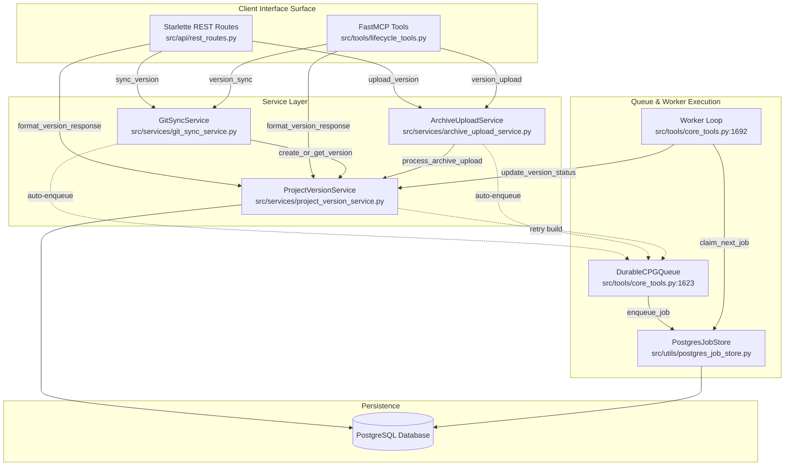

# Durable CPG Lifecycle & Backend Contract — Giải thích Kỹ Thuật

**Phạm vi:** Phase 6 (v0.7) — CodeBadger  
**Trạng thái:** **Đã hoàn thành 100% (Implemented & Verified)**. Tài liệu này giải thích chi tiết luồng xử lý kỹ thuật của toàn bộ Phase 6 kèm vị trí mã nguồn thực tế (`file:dòng`).

---

## 1. Vấn đề — Tại sao cần module này?

**Q: Sau khi tạo được một `ProjectVersion` (snapshot code bất biến ở Phase 5), làm sao để quản lý vòng đời CPG (Code Property Graph) bền vững, hỗ trợ khôi phục sự cố, và cung cấp API đồng nhất cho REST/MCP?**

Phase 5 xây dựng phần **Ingestion** — đồng bộ Git branch, tạo version bất biến. Nhưng version đó mới chỉ là thư mục source code và record trong DB. Để AI Agent query được (tìm symbol, taint, data flow), hệ thống phải chạy **Joern** để tạo ra **CPG** (`.cpg.bin`). Quá trình này gặp các thách thức:

- **Tốn tài nguyên & thời gian:** Joern JVM build rất nặng, không thể xử lý đồng bộ trong HTTP request.
- **Phải bền vững (Durable):** Nếu ứng dụng crash/restart giữa chừng, job build không được biến mất mà phải tự khôi phục hoặc đánh dấu lỗi an toàn.
- **Tính bất biến & Single-Active-Job:** Không được phép spawn 2 job build song song cho cùng một `version_id`.
- **Quan sát chi tiết (Observability):** Client cần biết chính xác version đang ở trạng thái nào (`queued`, `building`, `loading`, `ready`, `failed`, `cancelled`), vị trí trong hàng đợi, thời gian thực thi, số lần retry, và lý do lỗi (đã được mask credential/path).
- **Đồng nhất giao diện (REST/MCP Parity):** Cả REST API và MCP tool phải trả về **cùng một JSON Schema response**, giúp client không bị lệch contract khi đổi transport.

---

## 2. Nội dung chính — Từng bước một

Phase 6 được triển khai qua 4 luồng chính:

| Luồng (Flow) | Mô tả | File chính |
|---|---|---|
| **F1. Schema & Auto-Enqueue** | Mở rộng `ProjectVersion` schema, DB index dedup, tự enqueue job khi version mới tạo | `src/models.py`, `src/utils/postgres_job_store.py` |
| **F2. State Transitions & Worker** | Worker chuyển đổi trạng thái `queued → building → loading → ready/failed` | `src/tools/core_tools.py`, `src/services/project_version_service.py` |
| **F3. Cancel, Retry & Recovery** | Hủy build an toàn, retry bất biến, khôi phục crash kèm capped retry (max 3) | `src/services/project_version_service.py`, `src/utils/postgres_job_store.py` |
| **F4. Ingestion & Parity Surface** | Nạp source từ file nén (ZipSlip-safe), REST API routes và MCP Tools | `src/services/archive_upload_service.py`, `src/api/rest_routes.py`, `src/tools/lifecycle_tools.py` |

---

### F1 — Schema Extension & Single-Active-Job Deduplication

#### Bước 1. Mở rộng `ProjectVersion` Dataclass & Bảng Database

Trong `src/models.py:76`, class `ProjectVersion` được bổ sung các trường theo dõi trạng thái:
- `build_status`: `queued`, `building`, `loading`, `ready`, `failed`, hoặc `cancelled` (mặc định: `"queued"`).
- `build_metadata`: chứa `queue_position`, `elapsed_ms`, `retry_count`, `error` (dạng dictionary).
- `updated_at`: thời điểm cập nhật trạng thái gần nhất.

```python
# src/models.py:76-88
@dataclass
class ProjectVersion:
    id: str
    project_id: str
    commit_sha: str
    branch: str
    content_digest: str
    build_config: Dict[str, Any] = field(default_factory=dict)
    manifest: Dict[str, Any] = field(default_factory=dict)
    source_snapshot_ref: Optional[str] = None
    build_status: str = "queued"
    build_metadata: Dict[str, Any] = field(default_factory=dict)
    created_at: datetime = field(default_factory=_now_utc)
    updated_at: datetime = field(default_factory=_now_utc)
```

`PostgresDBManager.init_schema()` (`src/utils/postgres_db_manager.py:70`) tự động chạy migration idempotently thêm các cột này vào DB:

```python
# src/utils/postgres_db_manager.py:88-90
conn.execute("ALTER TABLE project_versions ADD COLUMN IF NOT EXISTS build_status TEXT NOT NULL DEFAULT 'queued'")
conn.execute("ALTER TABLE project_versions ADD COLUMN IF NOT EXISTS build_metadata TEXT DEFAULT '{}'")
conn.execute("ALTER TABLE project_versions ADD COLUMN IF NOT EXISTS updated_at TEXT")
```

#### Bước 2. Đảm bảo Single-Active-Job cấp Database bằng Partial Unique Index

Để chống race condition hoặc spam request tạo trùng job build cho cùng một version, `PostgresJobStore.init_schema()` (`src/utils/postgres_job_store.py:126`) khởi tạo index duy nhất:

```sql
-- src/utils/postgres_job_store.py:127
CREATE UNIQUE INDEX IF NOT EXISTS idx_jobs_version_active 
ON jobs(version_id, job_type) 
WHERE status IN ('queued', 'running') AND version_id IS NOT NULL;
```

Giải thích:
- Nếu một job cho `version_id` X đang ở trạng thái `'queued'` hoặc `'running'`, bất kỳ câu lệnh `INSERT` job mới cho `version_id` X sẽ bị DB chặn lại bằng lỗi unique constraint.

#### Bước 3. Git Sync Auto-Enqueue & Cache Reuse

Khi `GitSyncService.sync_project_branch` (`src/services/git_sync_service.py:100`) được gọi:
1. Nếu version đã tồn tại (`status == "unchanged"`): Không submit job mới, trả về version hiện tại.
2. Nếu version vừa tạo mới (`status == "created"`): Tự động nộp job vào `DurableCPGQueue` với `version_id`.

---

### F2 — Model 6 Trạng thái & State Transitions

#### 6 Trạng thái Vòng đời (`build_status`)

| Trạng thái | Điều kiện chuyển | Vị trí cập nhật code |
|---|---|---|
| `queued` | Version mới được tạo hoặc khôi phục/retry | `project_version_service.py:255` |
| `building` | Worker bắt đầu claim job và chạy Joern AST generator | `core_tools.py:1718` |
| `loading` | AST `.cpg.bin` tạo xong, đang load vào Joern Server | `core_tools.py:1729` |
| `ready` | CPG load thành công, server sẵn sàng nhận query | `core_tools.py:1735` |
| `failed` | Lỗi trong quá trình build/load (metadata chứa error đã mask) | `core_tools.py:1742` |
| `cancelled` | Người dùng yêu cầu hủy khi đang build | `project_version_service.py:313` |

#### Quá trình chuyển trạng thái trong CPG Worker

Worker `DurableCPGQueue._worker` trong `src/tools/core_tools.py:1692` quản lý chuyển đổi trạng thái:

```python
# src/tools/core_tools.py:1715-1745
# 1. Claim job -> Update building
self.version_service.update_version_status(version_id, "building", {"queue_position": 0})

# 2. Tạo AST xong -> Update loading
self.version_service.update_version_status(version_id, "loading", {"elapsed_ms": elapsed_build})

# 3. Server ready -> Update ready
self.version_service.update_version_status(version_id, "ready", {"elapsed_ms": total_elapsed})

# 4. Bắt Exception -> Mask error & Update failed
sanitized_err = sanitize_error_detail(str(e))
self.version_service.update_version_status(version_id, "failed", {
    "error": {"error_code": "BUILD_ERROR", "message": sanitized_err}
})
```

---

### F3 — Build Cancellation, Retry & Startup Reconciliation

#### 1. Explicit Build Cancellation (`cancel_version_build`)

Cho phép dừng tiến trình build đang chạy và dọn dẹp các tệp tạm thời.

```python
# src/services/project_version_service.py:291-358
def cancel_version_build(self, version_id: str, ...) -> Tuple[ProjectVersion, bool]:
    # Guard: Không được hủy version đã ready hoặc failed
    if version.build_status in ("ready", "failed"):
        raise ValueError(f"cannot cancel a {version.build_status} build")

    # Atomic SQL Update
    row = conn.execute(
        "UPDATE project_versions SET build_status = 'cancelled', updated_at = %s "
        "WHERE id = %s AND build_status IN ('queued', 'building', 'loading') RETURNING *",
        (now, version_id),
    ).fetchone()

    # Dọn dẹp artifact dở dang (.cpg.bin.tmp hoặc folder snapshot)
    if partial_artifacts:
        for art in partial_artifacts:
            shutil.rmtree(art, ignore_errors=True) if os.path.isdir(art) else os.remove(art)

    return cancelled_version, True
```

#### 2. Idempotent Build Retry (`retry_version_build`)

Cho phép thử lại các version bị `failed` hoặc `cancelled`.

```python
# src/services/project_version_service.py:361-424
def retry_version_build(self, version_id: str, queue=None, ...) -> Tuple[ProjectVersion, str]:
    if version.build_status == "ready":
        raise ValueError("cannot retry a ready build")
    if version.build_status in ("queued", "building", "loading"):
        return version, "already_active" # Idempotent - không tạo job trùng

    # Tăng retry_count trong metadata & reset build_status = 'queued'
    current_meta["retry_count"] = current_meta.get("retry_count", 0) + 1
    conn.execute(
        "UPDATE project_versions SET build_status = 'queued', build_metadata = %s, updated_at = %s "
        "WHERE id = %s AND build_status IN ('failed', 'cancelled')",
        (json.dumps(current_meta), now, version_id),
    )
    # Submit job mới vào queue
    queue.enqueue_job(...)
    return updated_version, "queued"
```

#### 3. Capped Retry Recovery Khi Server Restart (`requeue_running_jobs`)

Khi CodeBadger khởi động lại, `PostgresJobStore.requeue_running_jobs()` (`src/utils/postgres_job_store.py:296`) quét các job bị ngắt giữa chừng (đang ở trạng thái `running`):

```python
# src/utils/postgres_job_store.py:296-330
def requeue_running_jobs(self, max_retries: int = 3) -> int:
    for job in running_jobs:
        if job["attempts"] >= max_retries:
            # Vượt quá số lần thử tối đa -> Đánh dấu failed với mã EXCEEDED_MAX_RETRIES
            conn.execute("UPDATE jobs SET status = 'failed', error = 'EXCEEDED_MAX_RETRIES' WHERE id = %s", (job["id"],))
            conn.execute("UPDATE project_versions SET build_status = 'failed', build_metadata = ... WHERE id = %s", (job["version_id"],))
        else:
            # Còn trong hạn mức -> Chuyển về queued để chạy lại
            conn.execute("UPDATE jobs SET status = 'queued', attempts = attempts + 1 WHERE id = %s", (job["id"],))
            conn.execute("UPDATE project_versions SET build_status = 'queued' WHERE id = %s", (job["version_id"],))
```

---

### F4 — Archive Ingestion & REST / MCP Surface Parity

#### 1. ArchiveUploadService — Nạp Source từ File Nén An Toàn

Hỗ trợ nạp source code trực tiếp qua `.zip`, `.tar.gz`, `.tgz`.
Bảo vệ hệ thống khỏi lỗ hổng ZipSlip và Decompression Bomb:

```python
# src/services/archive_upload_service.py:80-145
# Lỗ hổng ZipSlip (Directory Traversal)
dest_path = os.path.abspath(os.path.join(target_dir, member.filename))
if not dest_path.startswith(target_dir_abs + os.sep):
    raise ValueError("Directory traversal attempt detected in archive")

# Chặn Symlink / Hardlink
if (member.external_attr >> 16 & 0o170000) == 0o120000:
    raise ValueError("Symlinks and hardlinks in archives are not permitted")

# Giới hạn kích thước giải nén (Max 500MB, Max 10,000 files)
if total_uncompressed > 500 * 1024 * 1024:
    raise ValueError("Archive exceeds maximum uncompressed size limit (500 MB)")
```

#### 2. REST API Routes & Standard Response Formatter

Tất cả các endpoint trả về thông tin Version đều đi qua hàm `format_version_response` (`src/api/rest_routes.py:14`):

```python
# src/api/rest_routes.py:14-28
def format_version_response(version: ProjectVersion, queue_pos: int = 0) -> Dict[str, Any]:
    meta = version.build_metadata or {}
    return {
        "id": version.id,
        "project_id": version.project_id,
        "commit_sha": version.commit_sha,
        "branch": version.branch,
        "status": version.build_status,
        "phase": version.build_status,
        "queue_position": meta.get("queue_position", queue_pos),
        "elapsed_ms": meta.get("elapsed_ms", 0),
        "retry_count": meta.get("retry_count", 0),
        "error": meta.get("error"),
        "created_at": version.created_at.isoformat(),
        "updated_at": version.updated_at.isoformat(),
    }
```

Danh sách các REST API Endpoints (`src/api/rest_routes.py:120`):
- `POST /projects` — Đăng ký project mới.
- `GET /projects` & `GET /projects/{id}` — Lấy danh sách/chi tiết project.
- `DELETE /projects/{id}` — Xóa project.
- `POST /projects/{id}/versions/update` — Đồng bộ Git branch & auto-enqueue build.
- `POST /projects/{id}/versions` — Upload archive source code & build.
- `GET /versions` & `GET /versions/{id}` — Truy vấn danh sách/trạng thái version.
- `POST /versions/{id}/retry` — Thử lại build bị lỗi/hủy.
- `POST /versions/{id}/cancel` — Hủy tiến trình build đang chạy.

#### 3. MCP Tools Schema Parity

9 MCP tools tương ứng được đăng ký trong `src/tools/lifecycle_tools.py`:
- `project_create`, `project_list`, `project_delete`
- `version_sync`, `version_upload`, `version_list`, `version_get`, `version_retry`, `version_cancel`

Cả MCP Tools và REST API đều sử dụng chung `format_version_response(v)` nên dữ liệu trả về cho Client hoàn toàn đồng nhất 100%.

---

## 3. Flowchart — Sơ đồ xử lý logic (Mermaid)



---

## 4. CallGraph — Sơ đồ quan hệ hàm (Mermaid)



---

## 5. Ví dụ hình dung (Analogy) — Bưu cục & Băng chuyền xử lý hàng

Để dễ hình dung toàn bộ luồng Phase 6, hãy tưởng tượng một **Bưu cục vận chuyển quốc tế**:

| Thao tác kỹ thuật trong CodeBadger | Ví dụ trong Bưu cục |
|---|---|
| **Register Project** | Đăng ký tài khoản doanh nghiệp gửi hàng tại bưu cục. |
| **Version (Snapshot)** | Một **kiện hàng** độc nhất có gắn mã vạch (SHA digest). Khi hàng tới kho, nếu mã vạch này đã có trong kho → trả thông báo `unchanged` (không xử lý lại). |
| **Single-Active-Job (Unique Index)** | Nguyên tắc: Một kiện hàng chỉ được nằm trên **một băng chuyền** tại một thời điểm. Không đưa 2 kiện trùng mã lên băng chuyền cùng lúc. |
| **Queue (`queued`)** | Kiện hàng nằm trong **hàng đợi xếp hàng** chờ máy phân loại. |
| **Worker (`building` & `loading`)** | **Máy đóng gói tự động**: bóc dán nhãn (`building` - parse AST) và đưa vào kệ lưu trữ thông minh (`loading` - load Joern server). |
| **Status `ready`** | Kiện hàng đã lưu kho hoàn tất, nhân viên (AI Agent) có thể tới xuất/truy vấn thông tin bất kỳ lúc nào. |
| **Status `cancelled`** | Chủ hàng gọi điện hủy đơn giữa chừng: Máy lập tức gắp kiện hàng ra khỏi băng chuyền, tiêu hủy vỏ hộp dở dang (`partial artifacts`), nhưng vẫn **ghi sổ nhật ký hủy**. |
| **Startup Recovery (`requeue_running_jobs`)** | Bưu cục bị **mất điện đột ngột**: Khi có điện lại, hệ thống quét các kiện đang dừng dở trên băng chuyền. Kiện nào kẹt quá 3 lần (`attempts >= 3`) sẽ đẩy sang ô hàng lỗi (`failed`), kiện nào mới bị kẹt sẽ chạy lại từ đầu. |

---

## 6. Bảng mapping source code

| Component / Function | File Path & Line | Vai trò & Trách nhiệm |
|---|---|---|
| `ProjectVersion` dataclass | `src/models.py:76` | Định nghĩa entity Version bổ sung `build_status` và `build_metadata`. |
| DB Schema & Migration | `src/utils/postgres_db_manager.py:70` | Migration bảng `project_versions` (thêm `build_status`, `build_metadata`, `updated_at`). |
| Partial Unique Index | `src/utils/postgres_job_store.py:126` | Đảm bảo duy nhất 1 job active per version cấp PostgreSQL. |
| `create_or_get_version` | `src/services/project_version_service.py:205` | Tạo version bất biến mới hoặc trả về version sẵn có (`created`/`unchanged`). |
| `cancel_version_build` | `src/services/project_version_service.py:291` | Hủy build an toàn, kiểm tra state guard, xóa artifact dở dang. |
| `retry_version_build` | `src/services/project_version_service.py:361` | Retry idempotent cho version lỗi/hủy, tăng `retry_count`. |
| `requeue_running_jobs` | `src/utils/postgres_job_store.py:296` | Phục hồi job kẹt khi startup, giới hạn tối đa 3 lần thử (`max_retries`). |
| `ArchiveUploadService` | `src/services/archive_upload_service.py:18` | Ingest file zip/tarball, chống ZipSlip, Symlink và Decompression bomb. |
| `format_version_response` | `src/api/rest_routes.py:14` | Formatter tạo response JSON chuẩn hóa cho CẢ REST API lẫn MCP Tools. |
| REST API Routes | `src/api/rest_routes.py:31` | Đăng ký các endpoints REST API quản lý project/version/build. |
| MCP Lifecycle Tools | `src/tools/lifecycle_tools.py:9` | Đăng ký 9 FastMCP tools tương đương 100% về Schema với REST API. |

---

## Kiểm tra chất lượng (Verification Checkpoints)

- [x] **Vấn đề → Giải pháp**: Giải thích đầy đủ tại Mục 1.
- [x] **Code Snippet + File Path**: Trích dẫn chính xác kèm số dòng thực tế tại Mục 2.
- [x] **Flowchart**: Mermaid Flowchart thể hiện chi tiết logic xử lý tại Mục 3.
- [x] **CallGraph**: Mermaid CallGraph mô tả quan hệ các layer tại Mục 4.
- [x] **Analogy**: Ví dụ bưu cục & băng chuyền dễ hiểu tại Mục 5.
- [x] **Source Mapping**: Bảng tổng hợp file path & vai trò tại Mục 6.
- [x] **Kịch bản Test**: Đã pass 100% 35 unit/contract tests qua pytest.
